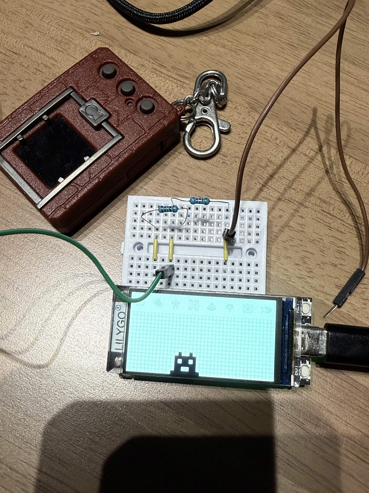

# S3VPet (Digimon V-Pet for T-Display-S3)

Referencing <a href="https://github.com/Berational91/DigimonVPet">DigimonVPet by Berational91</a> 
Port in for <a href="https://github.com/Xinyuan-LilyGO/T-Display-S3"> Lilygo T-Display-S3</a>
Compile code with Arduino IDE  

Clone the DigimonVPet_S3 file and open DigimonVPet_S3.ino on Arduino IDE
install all include library before compile.

## Coding direction
Keep VPet as a module so WiFiCom can later call vpet.

Target integration wificom library 
<a href="https://github.com/mintmakerenterprise/s3wificom">S3wificom by Mint Maker</a>

## S3 VPet Preview

## Arduino IDE Settings
Ensure you select these parameter during ino upload.

| Arduino IDE Setting | Value |
|---|---|
| Board | ESP32S3 Dev Module |
| Port | Your port |
| USB CDC On Boot | Enable |
| CPU Frequency | 240MHz (WiFi) |
| Core Debug Level | None |
| USB DFU On Boot | Disable |
| Erase All Flash Before Sketch Upload | Disable |
| Events Run On | Core 1 |
| Flash Mode | QIO 80MHz |
| Flash Size | 16MB (128Mb) |
| Arduino Runs On | Core 1 |
| USB Firmware MSC On Boot | Disable |
| Partition Scheme | 16M Flash (3M APP / 9.9MB FATFS) |
| PSRAM | OPI PSRAM |
| Upload Mode | UART0 / Hardware CDC |
| Upload Speed | 921600 |
| USB Mode | CDC and JTAG |

For complete upload steps, refer <a href="https://github.com/Xinyuan-LilyGO/T-Display-S3"> Arduino IDE Manual installation</a>

## Project Inspiration / Referencing Berational91 

> This is an early version of a Digimon VPet for the ESP32 and other Arduino compatible devices. At the moment there are just [TFT_eSPI](https://github.com/Bodmer/TFT_eSPI/) compatible displays supported. But you can make your own display working by just implementing a realization of the abstract `DisplayAdapter` class with just 8 methods. The goal of this project is to implement a Digimon VPet with all the functionality of real VPets and compatibility to real Digimon VPets.
>
> At the moment there is just the UI implemented but no functionality. But the long-term goals are:
>
> **Hardware independence:**
>
> - The hardware should be highly customizable, so you can use different displays, different inputs, etc.
>
> **Functionality:**
>
> - Internet connectivity through WiFi
> - [A-/D-Com](https://www.alphahub.site/guide) functionality
> - It should have a function to act as a gate, to allow 2 people to fight, jogress, etc. with their original VPETs through the internet
> - It should be compatible with real VPETs, so you can fight, jogress, etc. ESP-VPET vs Original-VPET
> - Ability to connect via Bluetooth to other ESP32 VPets to fight, jogress, etc.
>
> **Customizable:**
>
> - It should be easy to add new Digimon, pets, and evolution lines
> - It should be easy to change game mechanics and the UI
